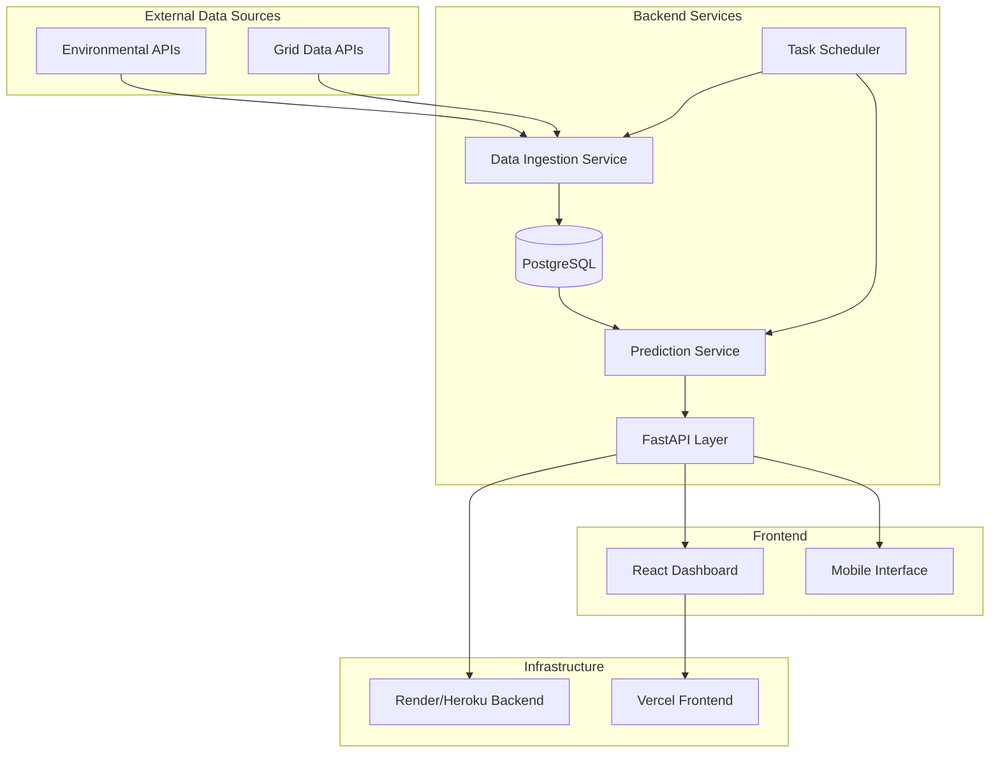

# Design Document

## Overview

The Clean Energy Predictor is a full-stack web application that combines real-time data ingestion, machine learning predictions, and interactive visualization to help users optimize their electricity usage for minimal environmental impact. The system follows a microservices architecture with clear separation between data ingestion, prediction services, API layer, and frontend components.

## Architecture



## Components and Interfaces

### Data Ingestion Service

**Purpose:** Fetch and store real-time environmental and grid data

**Key Components:**
- `DataFetcher`: Handles API calls to external data sources
- `DataValidator`: Validates incoming data for completeness and accuracy
- `DataStore`: Manages database operations for raw and processed data

**External APIs:**
- Environmental data: OpenWeatherMap API, EPA Air Quality API
- Grid data: EIA (Energy Information Administration) API, regional grid operators
- Backup sources: NOAA weather data, local utility APIs

**Data Models:**
```python
class EnvironmentalData:
    timestamp: datetime
    location: str
    temperature: float
    humidity: float
    wind_speed: float
    solar_irradiance: float
    air_quality_index: int

class GridData:
    timestamp: datetime
    region: str
    renewable_percentage: float
    coal_percentage: float
    natural_gas_percentage: float
    nuclear_percentage: float
    total_demand: float
    carbon_intensity: float  # gCO2/kWh
```

### Prediction Service (AI Model)

**Purpose:** Generate hourly cleanliness predictions for the next 24 hours

**Model Architecture:**
- Primary: Prophet time-series forecasting for seasonal patterns
- Secondary: Random Forest Regressor for feature-based predictions
- Ensemble: Weighted average based on recent performance metrics

**Features:**
- Time-based: hour of day, day of week, month, season
- Environmental: temperature, humidity, wind speed, solar irradiance
- Grid: current renewable mix, demand patterns, historical carbon intensity
- Lag features: previous 6 hours of cleanliness scores

**Model Pipeline:**
```python
class PredictionPipeline:
    def __init__(self):
        self.prophet_model = Prophet()
        self.rf_model = RandomForestRegressor()
        self.feature_scaler = StandardScaler()
        
    def train(self, historical_data: pd.DataFrame):
        # Train Prophet on time series
        # Train Random Forest on engineered features
        # Calculate ensemble weights
        
    def predict(self, current_data: dict) -> List[float]:
        # Generate 24-hour predictions
        # Return cleanliness scores 0-100
```

### API Layer

**Purpose:** Provide RESTful endpoints for frontend and third-party integrations

**Endpoints:**

```python
# FastAPI route definitions
@app.get("/predictions")
async def get_predictions(location: str = "default") -> PredictionsResponse:
    """Returns 24-hour cleanliness predictions"""
    
@app.get("/impact")
async def get_impact_metrics(
    location: str = "default",
    usage_kwh: float = 1.0
) -> ImpactResponse:
    """Returns CO2 savings in relatable terms"""
    
@app.get("/locations")
async def get_supported_locations() -> LocationsResponse:
    """Returns list of supported locations"""
    
@app.post("/notifications/subscribe")
async def subscribe_notifications(
    subscription: NotificationSubscription
) -> SubscriptionResponse:
    """Subscribe to clean energy notifications"""
```

**Response Models:**
```python
class PredictionPoint:
    timestamp: datetime
    cleanliness_score: float  # 0-100
    confidence: float  # 0-1
    carbon_intensity: float  # gCO2/kWh

class ImpactMetrics:
    co2_saved_kg: float
    trees_equivalent: int
    car_km_avoided: float
    coal_plants_offset_hours: float
```

### Frontend Components

**Technology Stack:**
- React 18 with TypeScript
- TailwindCSS for styling
- Chart.js for data visualization
- React Query for API state management
- PWA capabilities for mobile notifications

**Component Architecture:**
```
src/
├── components/
│   ├── Dashboard/
│   │   ├── Timeline.tsx          # Color-coded 24h timeline
│   │   ├── ImpactPanel.tsx       # Environmental impact metrics
│   │   └── LocationSelector.tsx  # Geographic location picker
│   ├── Notifications/
│   │   └── NotificationManager.tsx
│   └── Common/
│       ├── LoadingSpinner.tsx
│       └── ErrorBoundary.tsx
├── hooks/
│   ├── usePredictions.ts
│   ├── useImpactMetrics.ts
│   └── useNotifications.ts
├── services/
│   └── api.ts                    # API client
└── utils/
    ├── colorMapping.ts           # Score to color conversion
    └── impactCalculations.ts     # Impact metric helpers
```

**Timeline Component Design:**
- Horizontal scrollable timeline showing 24 hours
- Color gradient: Red (0-30) → Yellow (31-70) → Green (71-100)
- Interactive hover states with detailed tooltips
- Responsive breakpoints: mobile (single column), tablet (condensed), desktop (full width)

## Data Models

### Database Schema

```sql
-- Environmental data table
CREATE TABLE environmental_data (
    id SERIAL PRIMARY KEY,
    timestamp TIMESTAMP WITH TIME ZONE NOT NULL,
    location VARCHAR(100) NOT NULL,
    temperature DECIMAL(5,2),
    humidity DECIMAL(5,2),
    wind_speed DECIMAL(5,2),
    solar_irradiance DECIMAL(8,2),
    air_quality_index INTEGER,
    created_at TIMESTAMP DEFAULT NOW()
);

-- Grid data table
CREATE TABLE grid_data (
    id SERIAL PRIMARY KEY,
    timestamp TIMESTAMP WITH TIME ZONE NOT NULL,
    region VARCHAR(100) NOT NULL,
    renewable_percentage DECIMAL(5,2),
    coal_percentage DECIMAL(5,2),
    natural_gas_percentage DECIMAL(5,2),
    nuclear_percentage DECIMAL(5,2),
    total_demand DECIMAL(10,2),
    carbon_intensity DECIMAL(8,2),
    created_at TIMESTAMP DEFAULT NOW()
);

-- Predictions table
CREATE TABLE predictions (
    id SERIAL PRIMARY KEY,
    location VARCHAR(100) NOT NULL,
    prediction_timestamp TIMESTAMP WITH TIME ZONE NOT NULL,
    target_timestamp TIMESTAMP WITH TIME ZONE NOT NULL,
    cleanliness_score DECIMAL(5,2) NOT NULL,
    confidence DECIMAL(3,2),
    model_version VARCHAR(50),
    created_at TIMESTAMP DEFAULT NOW()
);

-- User subscriptions for notifications
CREATE TABLE notification_subscriptions (
    id SERIAL PRIMARY KEY,
    user_id VARCHAR(255) NOT NULL,
    location VARCHAR(100) NOT NULL,
    notification_threshold INTEGER DEFAULT 80,
    advance_notice_hours INTEGER DEFAULT 2,
    enabled BOOLEAN DEFAULT TRUE,
    created_at TIMESTAMP DEFAULT NOW()
);
```

### Indexes for Performance
```sql
CREATE INDEX idx_env_data_location_time ON environmental_data(location, timestamp DESC);
CREATE INDEX idx_grid_data_region_time ON grid_data(region, timestamp DESC);
CREATE INDEX idx_predictions_location_target ON predictions(location, target_timestamp);
```

## Error Handling

### Data Ingestion Resilience
- **API Failures:** Exponential backoff retry (1s, 2s, 4s) with circuit breaker pattern
- **Data Validation:** Reject incomplete records, log anomalies, use interpolation for minor gaps
- **Database Errors:** Connection pooling with automatic reconnection, transaction rollbacks

### Prediction Service Robustness
- **Model Failures:** Fallback to simpler linear regression if ML models fail
- **Missing Data:** Use historical averages and seasonal patterns for imputation
- **Performance Monitoring:** Track prediction accuracy, alert if error rate >25%

### API Layer Reliability
- **Rate Limiting:** 100 requests/minute per IP, 1000/hour for authenticated users
- **Input Validation:** Pydantic models for request/response validation
- **Graceful Degradation:** Return cached predictions if real-time generation fails

### Frontend Error Handling
- **Network Errors:** Retry failed requests with exponential backoff
- **Data Loading:** Skeleton screens during loading, error boundaries for crashes
- **Offline Support:** Service worker caching for core functionality

## Testing Strategy

### Unit Testing (Target: >90% Coverage)

**Backend Tests:**
```python
# Data ingestion tests
def test_data_fetcher_handles_api_timeout()
def test_data_validator_rejects_invalid_data()
def test_data_store_handles_duplicate_timestamps()

# Prediction service tests
def test_model_training_with_insufficient_data()
def test_prediction_accuracy_within_bounds()
def test_ensemble_model_weighting()

# API tests
def test_predictions_endpoint_returns_24_hours()
def test_impact_endpoint_calculates_correctly()
def test_rate_limiting_enforcement()
```

**Frontend Tests:**
```typescript
// Component tests
describe('Timeline Component', () => {
  test('renders 24 hour segments')
  test('applies correct color coding')
  test('handles mobile responsive layout')
})

// Hook tests
describe('usePredictions', () => {
  test('fetches and caches prediction data')
  test('handles API errors gracefully')
  test('refreshes data on location change')
})
```

### Integration Testing

**End-to-End Flow Tests:**
1. **Data Pipeline:** Mock external APIs → verify database storage → confirm prediction generation
2. **API Integration:** Test complete request/response cycle with real database
3. **Frontend Integration:** Cypress tests for user workflows (location selection, timeline interaction, notification setup)

**Performance Testing:**
- Load testing: 1000 concurrent users, <2s response time for predictions endpoint
- Database performance: Query optimization for time-series data retrieval
- Frontend performance: Lighthouse CI integration, target >90 performance score

### Deployment Testing

**Staging Environment:**
- Mirror production infrastructure on Render/Vercel
- Automated deployment pipeline with rollback capabilities
- Blue-green deployment strategy for zero-downtime updates

**Monitoring and Alerting:**
- Application metrics: Response times, error rates, prediction accuracy
- Infrastructure metrics: CPU, memory, database connections
- Business metrics: User engagement, notification effectiveness

This design provides a robust, scalable foundation for the Clean Energy Predictor application while addressing all requirements with specific technical implementations and comprehensive error handling strategies.